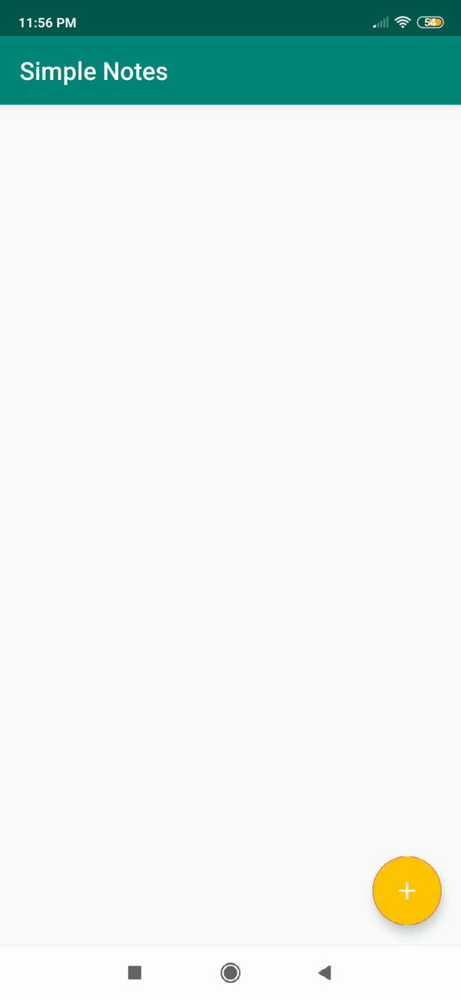

> Simple Notes App

<b> Problem Statement: </b>
Taking good notes in class is an important part of academic success in college. Actively taking notes during class can help you focus and better understand main concepts. ... Good note-taking will improve your active listening, comprehension of material, and retention.

<b> Proposed Solution : </b>
 Simple notes app allows you to create online notes under each project. It provides you a place to save all your creative ideas, thoughts, and critical project details, and access them quickly whenever needed. These notes can be kept private or shared with other team members for collaborative purposes.

<h4>Features</h4>
<ul>
  <li>Add Note</li>
   <li>Delete Note</li>
   <li>Edit Note</li>
  </ul>

<h4>Screenshots</h4>
<table>
<thead>
<tr>
<th align="center">Add Notes</th>
<th align="center">Edit Notes</th>
<th align="center">Delete Notes</th>
</tr>
</thead>
<tbody>
<tr>
<td> </td>
<td> </td>
<td> </td>
</tr>
</tbody>
</table>

<ul>
<li>Lifecycles: It manages activity and fragment lifecycles of our app, survives configuration changes,
avoids memory leaks and easily loads data into our UI.</li>
<li>LiveData: It notifies views of any database changes. Use LiveData to build data objects that notify views when
the underlying database changes.</li>
<li>Room: It is a SQLite object mapping library. Use it to Avoid boilerplate code and easily 
convert SQLite table data to Java objects. Room provides compile time checks of SQLite statements
and can return RxJava, Flowable and LiveData observables.</li>
<li>ViewModel: It manages UI-related data in a lifecycle-conscious way. It stores UI-related data
that isn't destroyed on app rotations.</li>
 

 <h4>Library used</h4>
<ul>
<li><a href="https://developer.android.com/topic/libraries/architecture/room" target="_blank">Room</a></li>
<li><a href="https://developer.android.com/topic/libraries/architecture/viewmodel" target="_blank">Viewmodel</a></li>
<li><a href="https://developer.android.com/topic/libraries/architecture/livedata">Livedata</a></li>
<li><a href="https://github.com/google/dagger" target="_blank">Dagger2</a></li>
<li><a href="https://github.com/google/dagger" target="_blank">Dagger Android</a></li>
<li><a href="https://developer.android.com/kotlin/coroutines" target="_blank">Coroutines</a></li>
<li><a href="https://material.io/develop/android/docs/getting-started/" target="_blank">Material library</a></li>
<li><a href="https://developer.android.com/guide/navigation/navigation-getting-started" target="_blank">Navigation Component</a></li>
  <li><a href="https://developer.android.com/guide/navigation/navigation-pass-data" target="_blank">Safe Args Plugin</a></li>
  
  
  
</ul>

